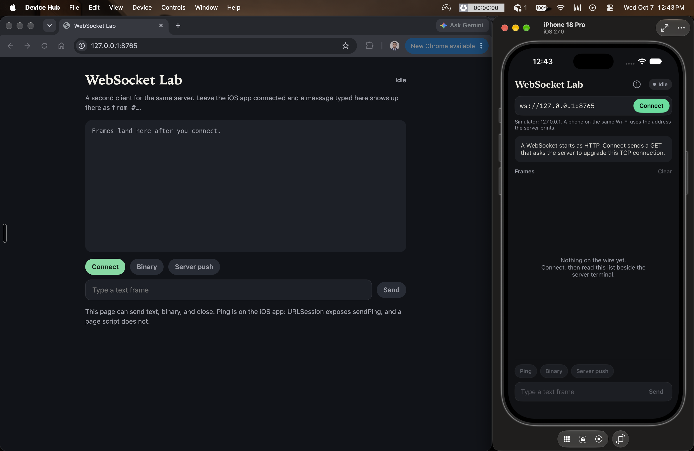
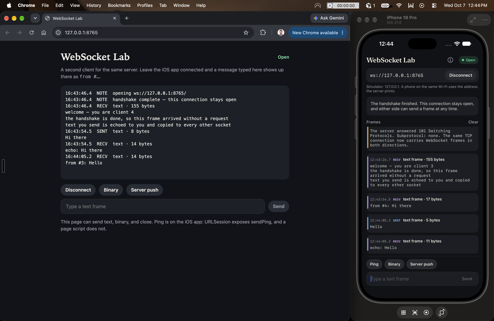

# WebSocket Lab

A small iOS app and a local server for learning WebSockets by watching one connection from both ends.

The app uses `URLSessionWebSocketTask`. That API hands you whole messages. The server in `server/server.py` is the other half: it performs the HTTP upgrade itself and prints every frame, including the mask key the app never shows.

```
client                         server
  |---- TCP connect -------------->|
  |---- GET Upgrade: websocket --->|
  |<--- 101 + Accept --------------|
  |==== text, binary, ping ========|
  |---- Close 1000 --------------->|
  |<--- Close 1000 ----------------|
```

After status 101, both sides write frames on that same TCP connection. A frame is a header plus a payload. The opcode says what the payload is: text (1), binary (2), close (8), ping (9), pong (10).

Client frames are masked. A 4-byte key is XOR'd across the payload so old HTTP proxies cannot mistake those bytes for another request. The server removes the mask and prints the key. Server frames are not masked.

`Sec-WebSocket-Accept` is `base64(SHA-1(key + 258EAFA5-E914-47DA-95CA-C5AB0DC85B11))`. The GUID is fixed by RFC 6455. Anyone who saw the key can recompute the accept value. It proves the server completed the handshake. The server checks itself against the sample in the RFC on startup:

`dGhlIHNhbXBsZSBub25jZQ==` → `s3pPLMBiTxaQ9kYGzzhZRbK+xOo=`

## Run it

From this folder:

```bash
python3 server/server.py
```

Open `WebSocketPOC.xcodeproj`, run it on the iOS Simulator, leave the URL as `ws://127.0.0.1:8765`, and tap Connect.

Use `127.0.0.1` in the Simulator. The server listens on IPv4, and `localhost` on a phone often tries IPv6 first. A real phone on the same Wi-Fi should use the `phone` address printed when the server starts.

Read the two logs together. The app shows what URLSession reports. The terminal shows the HTTP request, the 101, and each masked frame.

A second client is served from the same port. Open [http://127.0.0.1:8765](http://127.0.0.1:8765), connect, and send. The other client receives `from #…`.

## What it looks like

Both clients idle, before the handshake:



After both are open. The browser sent "Hi there", the app echoed it, then the app sent "Hello" and the browser received `from #3: Hello`:



## What to try

1. Connect and find `101 Switching Protocols` in the terminal.
2. Send a sentence. The app should show `echo:`, and the terminal should show `mask=` on the way in and `unmasked` on the way out.
3. Tap **Ping**. The pong shows up in the app because `sendPing` has its own callback. It does not come through `receive()`. The terminal shows both frames.
4. Tap **Binary**. The payload is the four bytes `de ad be ef`.
5. Tap **Server push**. The server writes three text frames on a timer. The app does not request each one.
6. Type `/clients` or `/close` if you want the server to answer with the open sockets, or to start the close itself.
7. Press Ctrl-C in the server terminal. The app should report that TCP dropped without a Close frame.

The in-app **How it works** sheet walks the same ground next to the buttons.

## Where the code lives

| File | What it teaches |
| --- | --- |
| `WebSocketPOC/WebSocketClient.swift` | Connect, receive, ping, and close with `URLSessionWebSocketTask` |
| `WebSocketPOC/ContentView.swift` | The log you watch while the socket is open |
| `server/server.py` | The upgrade, masking, opcodes, and a raw client under `--check` |
| `server/lab.html` | The browser `WebSocket` API. Page scripts can send text, binary, and close. Ping stays on the iOS side, where `sendPing` exists. |

`wss://` is this same conversation inside TLS. The lab uses `ws://` so the handshake stays readable. `Info.plist` allows cleartext connections on the local network and leaves the rest of App Transport Security in place.

Check the server without the app:

```bash
python3 server/server.py --check
```
